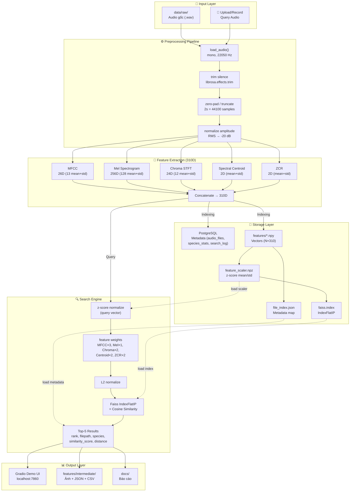
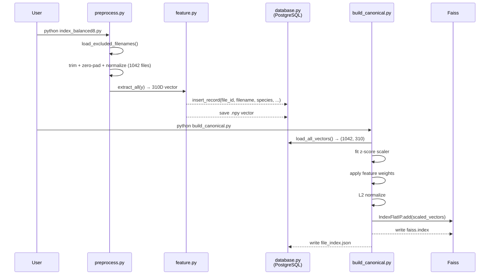
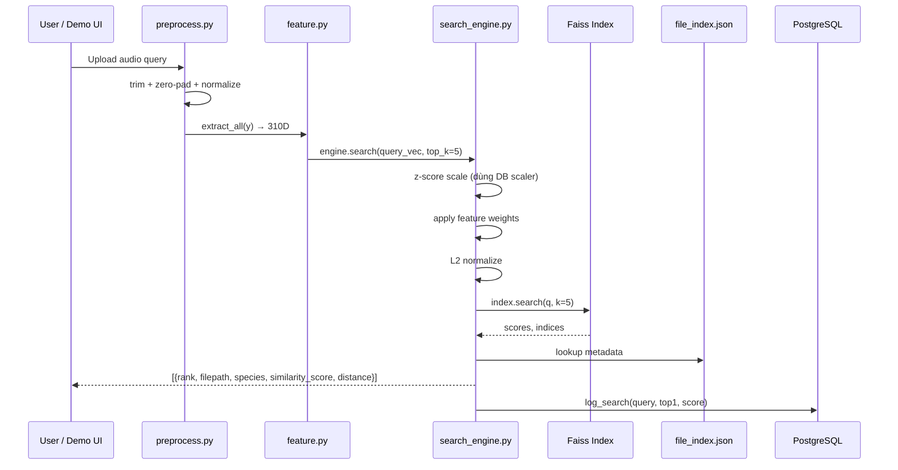

# Sơ Đồ Khối Hệ Thống

## 1. Kiến trúc tổng quan



## 2. Pipeline chi tiết

### 2.1 Indexing Pipeline (offline)



### 2.2 Search Pipeline (online)



## 3. Công nghệ sử dụng

| Layer | Công nghệ | Version |
|---|---|---|
| Language | Python | 3.10+ |
| Audio I/O | librosa, soundfile | 0.10+, 0.12+ |
| Feature | librosa (MFCC, Mel, Chroma, Centroid, ZCR) | 0.10+ |
| Vector Search | Faiss (IndexFlatIP) | 1.9+ |
| Metadata DB | PostgreSQL (via Docker) | 16-alpine |
| Python DB Driver | psycopg2-binary | 2.9+ |
| Demo UI | Gradio | 6.14+ |
| Testing | pytest | 8.3+ |
| Container | Docker Compose | v2 |

## 4. Cấu trúc Database

### PostgreSQL — 3 tables

```sql
audio_files    : id, file_id, filename, species, filepath, duration_sec,
                 sample_rate, source, quality, indexed_at, feat_path
species_stats  : species, file_count, avg_duration_sec, updated_at
search_log     : id, query_file, top1_result, top1_score, searched_at
```

### File-based storage

```
features/feature_db.npy       — (1042, 310) float32
features/feature_scaler.npz   — mean (310,), std (310,), weights (310,)
features/faiss.index           — Faiss IndexFlatIP, 1042 vectors
features/file_index.json       — {idx: {file_id, filepath, species, ...}}
```
