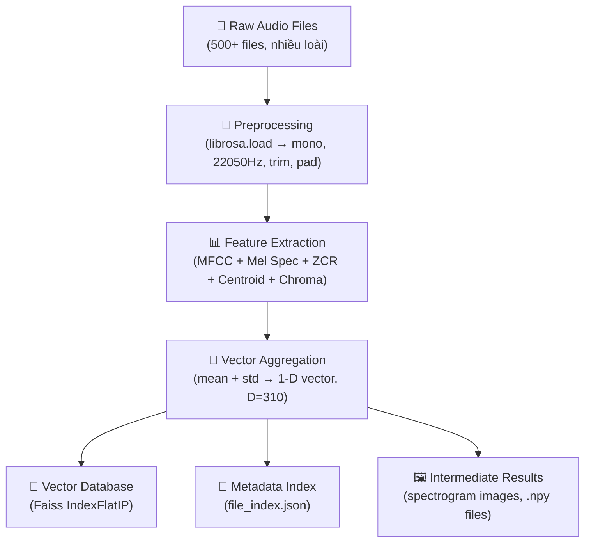
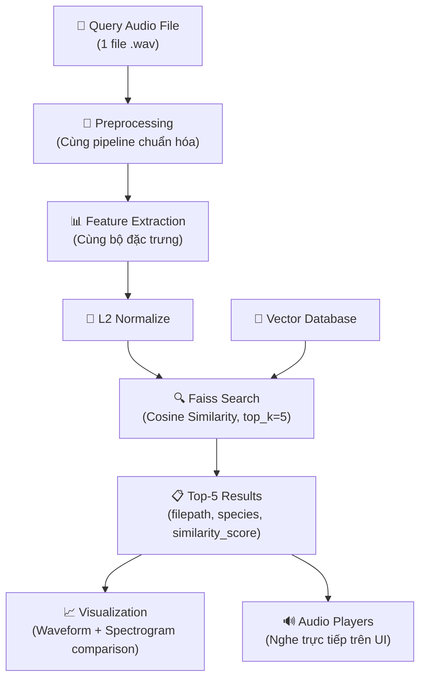

# 🧠 Skills – Kỹ năng chuyên môn của AI Agent

> Tài liệu này mô tả chi tiết các **kỹ năng chuyên môn** (domain expertise) mà AI Agent sở hữu và sẽ áp dụng xuyên suốt dự án.
> Mỗi kỹ năng bao gồm: phạm vi ứng dụng, kiến thức nền tảng, và cách thức triển khai cụ thể trong bối cảnh "Tìm kiếm tiếng động vật theo nội dung".

---

## S-01: Xử lý Tín hiệu Âm thanh Số (Digital Audio Signal Processing)

### Phạm vi
Chuyển đổi file âm thanh thô (raw audio) thành dạng dữ liệu chuẩn hóa, sẵn sàng cho bước trích xuất đặc trưng.

### Kiến thức nền tảng
- **Tín hiệu âm thanh số** là chuỗi mẫu (samples) lấy ra từ sóng âm tương tự theo tần số lấy mẫu (sample rate).
- **Sample Rate 22050 Hz:** Đủ biểu diễn tần số tới 11025 Hz (theo Nyquist), bao phủ toàn bộ dải tần tiếng động vật phổ biến (chó: 67–45000 Hz nhưng tiếng sủa tập trung 300–3000 Hz, mèo: 500–1500 Hz, chim: 1000–8000 Hz).
- **Mono channel:** Tiếng động vật không cần thông tin stereo — mono giảm lượng dữ liệu 50% mà không mất thông tin ngữ nghĩa.

### Triển khai cụ thể

```python
import librosa
import soundfile as sf
import numpy as np

def preprocess_audio(
    input_path: str,
    output_path: str,
    target_sr: int = 22050,
    target_duration: float = 5.0  # giây
) -> np.ndarray:
    """
    Chuẩn hóa file audio: mono, resample, trim/pad.

    Args:
        input_path: Đường dẫn file gốc
        output_path: Đường dẫn file sau chuẩn hóa
        target_sr: Sample rate mục tiêu
        target_duration: Độ dài mục tiêu (giây)

    Returns:
        np.ndarray: Tín hiệu audio đã chuẩn hóa
    """
    # Load + convert mono + resample
    y, sr = librosa.load(input_path, sr=target_sr, mono=True)

    # Trim silence ở đầu/cuối
    y, _ = librosa.effects.trim(y, top_db=20)

    # Pad hoặc truncate về độ dài chuẩn
    target_length = int(target_sr * target_duration)
    if len(y) < target_length:
        y = np.pad(y, (0, target_length - len(y)), mode='constant')
    else:
        y = y[:target_length]

    # Normalize amplitude
    y = y / np.max(np.abs(y) + 1e-8)

    # Lưu file
    sf.write(output_path, y, target_sr)
    return y
```

### Lưu ý quan trọng
- Luôn dùng `librosa.effects.trim()` để loại bỏ đoạn im lặng — tránh tăng nhiễu zero-padding vô nghĩa.
- Normalize amplitude về [-1, 1] để đảm bảo các đặc trưng không bị lệch do mức volume ghi âm khác nhau.

---

## S-02: Trích xuất Đặc trưng Âm thanh (Audio Feature Extraction)

### Phạm vi
Chuyển đổi tín hiệu âm thanh thành vector số cố định kích thước, đại diện cho "nội dung" âm thanh.

### Kiến thức nền tảng

#### MFCC – Mel-Frequency Cepstral Coefficients (Đặc trưng cốt lõi)
- **Bản chất:** Mô phỏng cách tai người cảm nhận âm thanh. Tai người nhạy cảm hơn ở tần số thấp → thang Mel phi tuyến tính biến đổi tần số theo đặc tính nhận thức này.
- **Tại sao phù hợp cho tiếng động vật:** Mỗi loài có cấu trúc thanh quản/khoang miệng khác nhau → tạo ra "dấu vân tay âm sắc" (timbral fingerprint) riêng biệt. MFCC nắm bắt chính xác đặc tính này.
- **Thông số:** `n_mfcc=13` (13 hệ số đầu tiên chứa ~95% thông tin phân biệt).

#### Mel Spectrogram
- **Bản chất:** Biểu diễn 2D (tần số × thời gian) của năng lượng âm thanh trên thang Mel.
- **Tại sao phù hợp:** Cho thấy mẫu lặp lại (repetition pattern) — tiếng chó sủa có mẫu burst-burst riêng biệt so với tiếng mèo kêu liên tục.

#### Zero Crossing Rate (ZCR)
- **Bản chất:** Tốc độ tín hiệu đổi dấu (dương ↔ âm) trên mỗi khung.
- **Tại sao phù hợp:** ZCR cao = âm thanh nhiều tạp âm/nhấn mạnh (tiếng rắn xì xì, côn trùng). ZCR thấp = âm thanh tonal rõ ràng (tiếng chim hót).

#### Spectral Centroid
- **Bản chất:** "Trung tâm khối lượng" của phổ tần — cho biết năng lượng âm thanh tập trung ở vùng tần số nào.
- **Tại sao phù hợp:** Tiếng chim = centroid cao (sáng, nhọn). Tiếng bò/trâu = centroid thấp (trầm, dày).

#### Chroma Features
- **Bản chất:** Phân bổ năng lượng trên 12 lớp cao độ (pitch classes).
- **Tại sao phù hợp:** Nhận diện melody pattern — hữu ích cho loài có tiếng kêu đa âm (chim, ếch).

### Triển khai

```python
import librosa
import numpy as np
from typing import Dict

def extract_features(
    y: np.ndarray,
    sr: int = 22050,
    n_mfcc: int = 13,
    n_mels: int = 128
) -> Dict[str, np.ndarray]:
    """
    Trích xuất toàn bộ đặc trưng từ tín hiệu audio.

    Args:
        y: Tín hiệu audio đã chuẩn hóa
        sr: Sample rate
        n_mfcc: Số hệ số MFCC
        n_mels: Số dải Mel

    Returns:
        Dict chứa các feature arrays
    """
    features = {}

    # MFCC (n_mfcc × n_frames) → mean + std → 2 * n_mfcc = 26 dims
    mfcc = librosa.feature.mfcc(y=y, sr=sr, n_mfcc=n_mfcc)
    features['mfcc_mean'] = np.mean(mfcc, axis=1)
    features['mfcc_std'] = np.std(mfcc, axis=1)

    # Mel Spectrogram (n_mels × n_frames) → mean + std → 2 * n_mels dims
    mel_spec = librosa.feature.melspectrogram(y=y, sr=sr, n_mels=n_mels)
    mel_spec_db = librosa.power_to_db(mel_spec, ref=np.max)
    features['mel_mean'] = np.mean(mel_spec_db, axis=1)
    features['mel_std'] = np.std(mel_spec_db, axis=1)

    # Spectral Centroid (1 × n_frames) → mean + std → 2 dims
    centroid = librosa.feature.spectral_centroid(y=y, sr=sr)
    features['centroid_mean'] = np.mean(centroid, axis=1)
    features['centroid_std'] = np.std(centroid, axis=1)

    # Zero Crossing Rate (1 × n_frames) → mean + std → 2 dims
    zcr = librosa.feature.zero_crossing_rate(y)
    features['zcr_mean'] = np.mean(zcr, axis=1)
    features['zcr_std'] = np.std(zcr, axis=1)

    # Chroma (12 × n_frames) → mean + std → 24 dims
    chroma = librosa.feature.chroma_stft(y=y, sr=sr)
    features['chroma_mean'] = np.mean(chroma, axis=1)
    features['chroma_std'] = np.std(chroma, axis=1)

    return features


def features_to_vector(features: Dict[str, np.ndarray]) -> np.ndarray:
    """
    Nối toàn bộ feature thành 1 vector 1-D cố định.

    Returns:
        np.ndarray: Vector đặc trưng shape (D,)
        Với default params: D = 26 + 256 + 2 + 2 + 24 = 310
    """
    return np.concatenate([v.flatten() for v in features.values()])
```

### Giá trị thông tin tổng hợp

| Đặc trưng | Chiều | Thông tin | Loại âm thanh phân biệt tốt |
|---|---|---|---|
| MFCC (mean+std) | 26 | Âm sắc (timbre) | Mèo vs. Chó vs. Gà |
| Mel Spec (mean+std) | 256 | Năng lượng phổ tần | Tiếng kêu liên tục vs. đứt quãng |
| Spectral Centroid | 2 | Độ sáng/tối | Chim (cao) vs. Bò (thấp) |
| ZCR | 2 | Độ nhọn/mượt | Rắn (cao) vs. Cá voi (thấp) |
| Chroma | 24 | Cao độ | Chim hót vs. Ếch kêu |
| **Tổng** | **310** | | |

---

## S-03: Xây dựng CSDL Vector & Thuật toán Tìm kiếm Tương tự (Vector Indexing & Similarity Search)

### Phạm vi
Tổ chức các vector đặc trưng thành cơ sở dữ liệu có khả năng truy vấn nhanh, và thực hiện tìm kiếm top-K tương đồng nhất.

### Kiến thức nền tảng

#### Cosine Similarity
```
sim(A, B) = (A · B) / (||A|| × ||B||)
```
- Giá trị trong [-1, 1], càng gần 1 = càng giống.
- **Ưu điểm:** Không nhạy cảm với magnitude (biên độ), chỉ so sánh "hướng" của vector → phù hợp khi volume ghi âm khác nhau.

#### L2 (Euclidean) Distance
```
d(A, B) = sqrt(Σ(A_i - B_i)²)
```
- Chuyển sang similarity: `sim = 1 / (1 + d)`

#### Faiss Index
- `faiss.IndexFlatIP` (Inner Product) sau khi L2-normalize → tương đương Cosine Similarity.
- `faiss.IndexFlatL2` cho Euclidean.
- Với 500 files, `IndexFlat` (brute-force) đủ nhanh, không cần approximate methods.

### Triển khai

```python
import faiss
import numpy as np
import json
from typing import List, Dict

class AnimalSoundDB:
    """Cơ sở dữ liệu vector cho tiếng động vật."""

    def __init__(self, dimension: int = 310):
        """
        Args:
            dimension: Chiều dài vector đặc trưng (D)
        """
        self.dimension = dimension
        # Dùng Inner Product sau normalize = Cosine Similarity
        self.index = faiss.IndexFlatIP(dimension)
        self.file_index: Dict[int, Dict] = {}

    def add_vectors(
        self,
        vectors: np.ndarray,
        metadata_list: List[Dict]
    ) -> None:
        """
        Thêm batch vector vào DB.

        Args:
            vectors: Ma trận (N, D) — float32
            metadata_list: List metadata tương ứng từng vector
        """
        # L2 Normalize để Inner Product = Cosine Similarity
        faiss.normalize_L2(vectors)
        self.index.add(vectors)

        start_id = len(self.file_index)
        for i, meta in enumerate(metadata_list):
            self.file_index[start_id + i] = meta

    def search(
        self,
        query_vector: np.ndarray,
        top_k: int = 5
    ) -> List[Dict]:
        """
        Tìm kiếm top_k file giống nhất.

        Args:
            query_vector: Vector đặc trưng file query, shape (D,)
            top_k: Số kết quả trả về (mặc định = 5)

        Returns:
            List[Dict] — Kết quả sắp xếp giảm dần theo similarity
        """
        # Reshape + normalize
        query = query_vector.reshape(1, -1).astype(np.float32)
        faiss.normalize_L2(query)

        # Search
        scores, indices = self.index.search(query, top_k)

        results = []
        for rank, (score, idx) in enumerate(zip(scores[0], indices[0]), 1):
            if idx == -1:
                continue
            meta = self.file_index[int(idx)]
            results.append({
                "rank": rank,
                "filepath": meta["filepath"],
                "species": meta["species"],
                "similarity_score": round(float(score), 4),
                "distance": round(float(1 - score), 4)
            })

        return results

    def save(self, index_path: str, metadata_path: str) -> None:
        """Lưu index và metadata xuống đĩa."""
        faiss.write_index(self.index, index_path)
        with open(metadata_path, 'w') as f:
            json.dump(self.file_index, f, indent=2, ensure_ascii=False)

    def load(self, index_path: str, metadata_path: str) -> None:
        """Load index và metadata từ đĩa."""
        self.index = faiss.read_index(index_path)
        with open(metadata_path, 'r') as f:
            self.file_index = {int(k): v for k, v in json.load(f).items()}
```

---

## S-04: Trực quan hóa & Phân tích So sánh (Visualization & Comparative Analysis)

### Phạm vi
Tạo biểu đồ trực quan cho quá trình trích xuất đặc trưng và kết quả tìm kiếm — phục vụ Demo và báo cáo trung gian.

### Khả năng

#### Loại biểu đồ Agent có thể sinh

| Biểu đồ | Mục đích | Thư viện |
|---|---|---|
| **Waveform** | Hiển thị biên độ theo thời gian | `librosa.display.waveshow()` |
| **Mel Spectrogram** | Hiển thị tần số theo thời gian (dạng heatmap) | `librosa.display.specshow()` |
| **MFCC Heatmap** | Hiển thị 13 hệ số MFCC qua từng frame | `librosa.display.specshow()` |
| **So sánh Query vs Results** | Đặt cạnh nhau waveform/spectrogram của query và top 5 | `matplotlib.pyplot.subplots()` |
| **Bar chart Similarity** | Thanh ngang hiển thị điểm similarity top 5 | `matplotlib.pyplot.barh()` |

### Triển khai mẫu

```python
import matplotlib.pyplot as plt
import librosa.display
import numpy as np

def plot_comparison(
    query_y: np.ndarray,
    result_audios: list[np.ndarray],
    result_labels: list[str],
    sr: int = 22050,
    save_path: str = None
) -> None:
    """
    Vẽ so sánh waveform giữa query và top 5 kết quả.

    Args:
        query_y: Tín hiệu query
        result_audios: List 5 tín hiệu kết quả
        result_labels: Nhãn hiển thị (tên file + score)
        sr: Sample rate
        save_path: Đường dẫn lưu ảnh (None = hiện trực tiếp)
    """
    fig, axes = plt.subplots(6, 1, figsize=(12, 14))
    fig.suptitle('Query vs Top-5 Results — Waveform Comparison', fontsize=14)

    # Query
    librosa.display.waveshow(query_y, sr=sr, ax=axes[0], color='#e74c3c')
    axes[0].set_title('🎤 Query Input', fontweight='bold')

    # Results
    colors = ['#3498db', '#2ecc71', '#f39c12', '#9b59b6', '#1abc9c']
    for i, (audio, label) in enumerate(zip(result_audios, result_labels)):
        librosa.display.waveshow(audio, sr=sr, ax=axes[i+1], color=colors[i])
        axes[i+1].set_title(f'#{i+1}: {label}')

    plt.tight_layout()
    if save_path:
        plt.savefig(save_path, dpi=150, bbox_inches='tight')
    plt.show()
```

---

## S-05: Thiết kế Sơ đồ Hệ thống (System Architecture Design)

### Phạm vi
Tạo sơ đồ khối (block diagrams) và flowchart minh họa luồng dữ liệu của toàn hệ thống — đáp ứng yêu cầu 3a của đề bài.

### Sơ đồ tham chiếu: Indexing Pipeline



### Sơ đồ tham chiếu: Query Pipeline



---

## S-06: Xây dựng Demo Web UI (Web Application Development)

### Phạm vi
Tạo giao diện web trực quan cho phép người dùng upload file audio và xem kết quả tìm kiếm real-time.

### Công nghệ ưu tiên: Streamlit

**Lý do chọn Streamlit:**
- Setup nhanh (1 file Python duy nhất)
- Hỗ trợ sẵn `st.audio()` cho Audio Player
- Hỗ trợ `st.pyplot()` cho biểu đồ matplotlib
- Hỗ trợ `st.file_uploader()` cho upload
- Phù hợp cho Demo học thuật (không cần frontend riêng)

### Giao diện mẫu (Layout Skeleton)

```
┌─────────────────────────────────────────────────────┐
│  🐾 Animal Sound Search Engine                      │
│  ─── Hệ CSDL Tìm kiếm Tiếng Động Vật ───          │
├─────────────────────────────────────────────────────┤
│                                                     │
│  📁 Upload Audio File      [Browse...]              │
│  ┌──────────────────────────────────────────┐       │
│  │ ▶ Audio Player (query)                    │       │
│  └──────────────────────────────────────────┘       │
│  ┌──────────────────────────────────────────┐       │
│  │ 📊 Waveform + Spectrogram (query)         │       │
│  └──────────────────────────────────────────┘       │
│                                                     │
│  [🔍 Search]                                        │
│                                                     │
├─────────────────────────────────────────────────────┤
│  📋 Search Results (Top 5)                          │
│  ┌───┬──────────────┬─────────┬────────────┐       │
│  │ # │ File         │ Species │ Similarity │       │
│  ├───┼──────────────┼─────────┼────────────┤       │
│  │ 1 │ cat_042.wav  │ Cat     │ 98.21%     │       │
│  │ 2 │ cat_017.wav  │ Cat     │ 95.44%     │       │
│  │ 3 │ cat_089.wav  │ Cat     │ 91.03%     │       │
│  │ 4 │ dog_003.wav  │ Dog     │ 72.18%     │       │
│  │ 5 │ bird_021.wav │ Bird    │ 65.92%     │       │
│  └───┴──────────────┴─────────┴────────────┘       │
│                                                     │
│  🔊 Audio Players (each result)                     │
│  📈 Comparison Charts (query vs results)            │
│                                                     │
└─────────────────────────────────────────────────────┘
```

### Tính năng nâng cao (tùy chọn)
- **Sidebar filter:** Lọc theo loài trước khi search.
- **Feature Explorer:** Tab hiển thị chi tiết vector đặc trưng của query file.
- **Database Statistics:** Thống kê số file theo loài, histogram phân bổ duration.
